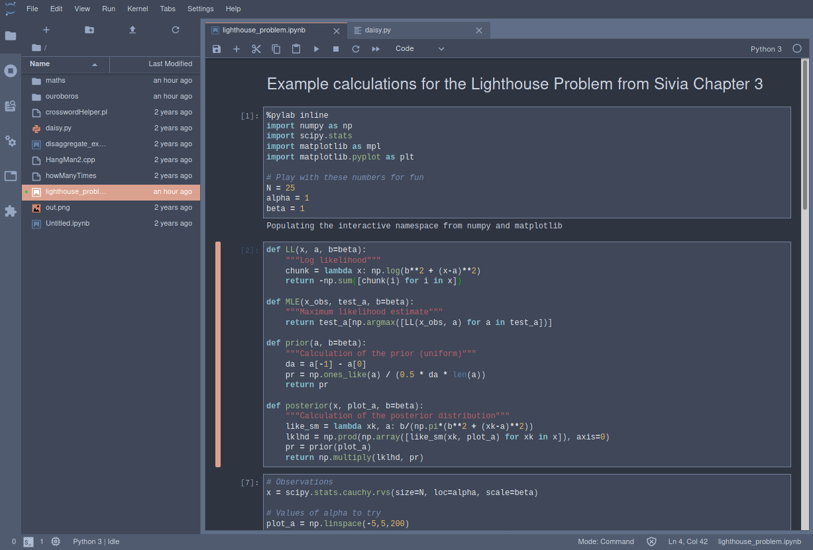
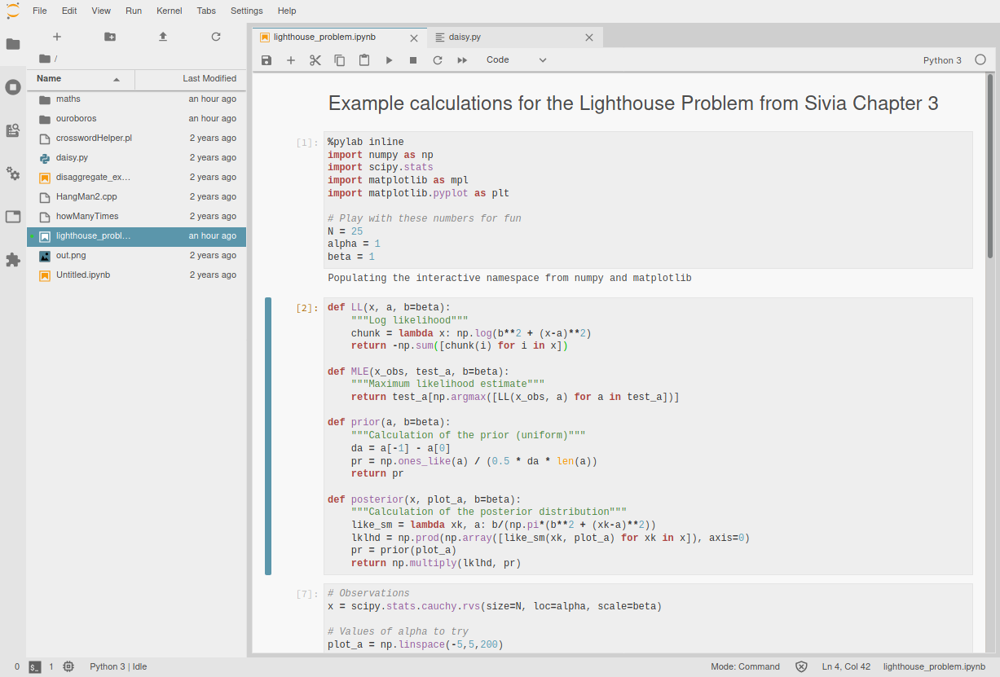

# jupyterlab-themes

:wave: Hi there! As of about mid-October I've decided to halt any development or updates to this project until Jupyterlab 3.0 
is released. Some of the updates in 3.0 should make theming easier, and I'd like to minimize the amount of extra work to be done.

:wave: :wave: Hi again! I've updated the project to be compatible with Jupyterlab 3! It's just a compatibility thing, but I'm
hoping to be able to dedicate some development time to this project around mid-March! Until then, feel free to file any issues you come across!

## Add more colors to your Jupyter Lab!

:exclamation: This plugin is in alpha stages. You are welcome to try to use and/or improve it,
 but stability is not guaranteed. If you want to help out, check out the contributing section below, or browse the
 issues! If you'd like to help fund further developments donations are greatly appreciated! 
 
 

## What is this?
Simply put, this is an extension to add a number of color themes to Juptyer Lab. I created this as a heavy user of
Jupyter Lab, and didn't particularly like the default dark scheme. I take *heavy* inspiration from the following
projects:

 - [base16](https://github.com/chriskempson/base16): Definitions of color schemes following a basic template
 - [jupyter-themes](https://github.com/dunovank/jupyter-themes): Themes for jupyter notebook
 - [theme-gruvbox](https://github.com/Rahlir/theme-gruvbox): gruvbox dark theme implemented for Jupyter Lab

## Installation
Currently, you have to install each of the themes individually. Themes be installed directly
via `npm` with the standard way of installing lab extensions:

```
jupyter labextension install @arbennett/base16-{$themename}
```

You can also install from source. This can be accomplished by running the following comands in a
theme's respective subdirectory:

```
npm install
jupyter labextension link .
```

## Example screenshots

### Nord theme


### Mexico theme


## Contributing
I am only able to work on this project intermittently, and would love to make this a community project.
If you would like to contribute feel free to open a pull request or file an issue! I'll do my best to
respond to PRs and issues as quickly as possible, and will probably prioritize that over doing more
development of my own.

### My workflow
Because I am not a web developer, my familiarity with javascript and typescript is somewhat limited.
Thus, the workflow I've developed here may seem odd or convoluted to those with more experience in this
domain. Basically, my workflow has been to edit the base stylesheets in the `scss` directory, and using the
`gen_css.sh` script to generate all of the `css` files directly. Then I update my builds as necessary.
If you know a better way to do this, please let me know!

### Bumping versions
Because I have cobbled together a strange workflow for updating all of the themes at once it's a bit unwieldy
to update the versioning consistently. This is the command I use (mostly for my own sake):

```
sed -i 's/"version": "CURRENT_VERSION"/"version": "NEW_VERSION"/g' ./**/package.json
```
